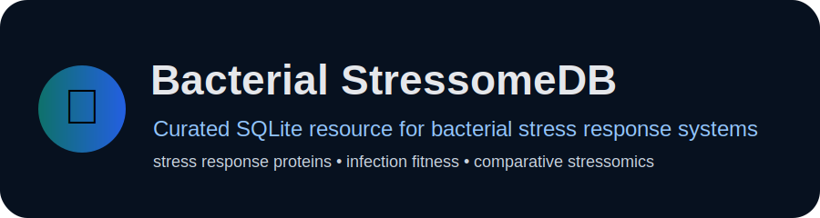
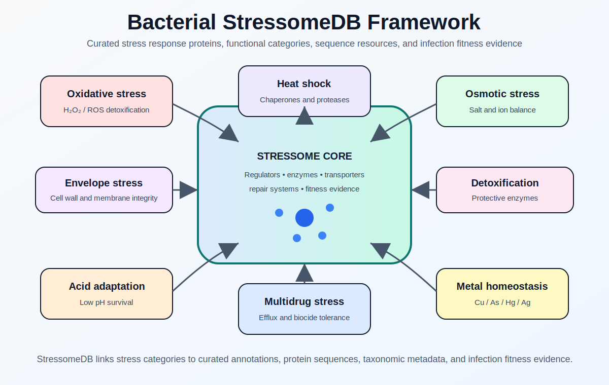
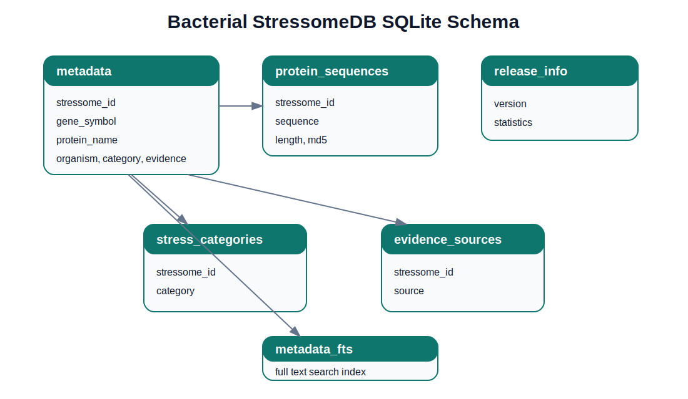

# 🦠 Bacterial StressomeDB

<p align="center">
  
</p>

<p align="center">
  <a href="https://bacterial-stressomedb.online/"></a>
  
  
  <a href="LICENSE"></a>
  <a href="CITATION.cff"></a>
</p>

## Overview

**Bacterial StressomeDB** is a curated biological resource for bacterial stress response systems across clinically important and environmentally relevant bacterial taxa. The bacterial **stressome** is defined here as the repertoire of genes, proteins, and functional systems that enable bacteria to sense, respond to, and survive environmental and host associated stresses.

The online resource is available at:

### 🌐 https://bacterial-stressomedb.online/

This GitHub repository provides the official downloadable **SQLite release** of Bacterial StressomeDB, together with documentation, schema information, citation metadata, and a lightweight local query utility. The web platform should be used for interactive browsing, visualization, sequence search, and online exploration.

---

## Stressome framework

<p align="center">
  
</p>

<p align="center"><b>Conceptual framework of bacterial stress response systems represented in Bacterial StressomeDB.</b></p>

---

## Database at a glance

| Feature | Current release |
|---|---:|
| Curated metadata records | 18,391 |
| Unique nonredundant protein sequences | 12,046 |
| Curated stress category labels | 24 |
| Higher order functional groups | 9 |
| Bacterial taxa | 1,466 |
| BacFITBase linked records | 3,378 |
| Infection fitness measurements used in the companion analysis | 1,969 |
| Official downloadable format | SQLite |

---

## Official database file

The repository distributes Bacterial StressomeDB as a single SQLite database:

```text
 database/
 └── Bacterial_StressomeDB_v1.sqlite
```

The SQLite file contains curated metadata, protein sequences, stress category assignments, evidence source information, release statistics, full text search support, and joined views for convenient querying. Separate CSV and FASTA files are not distributed in this release because all metadata and protein sequences are stored inside the SQLite database.

---

## What the database contains

| Component | Description |
|---|---|
| Stress response records | Curated stress response determinants with gene symbols, protein names, descriptions, organisms, accessions, and evidence metadata |
| Protein sequences | Sequence nonredundant protein reference set stored directly in SQLite |
| Stress categories | Twenty four curated category labels organized into nine higher order biological groups |
| Evidence sources | Integrated annotations from UniProtKB, KEGG Orthology, and BacFITBase |
| Infection fitness evidence | BacFITBase linked records and infection fitness annotations where available |
| Search index | SQLite full text search table for gene, protein, organism, accession, category, and description queries |

---

## Major stress response groups

StressomeDB organizes bacterial stress response determinants into nine higher order groups:

- Oxidative stress
- Metal homeostasis and resistance
- Acid adaptation
- Envelope stress
- Heat shock
- Osmotic stress
- Detoxification systems
- Multidrug and biocide efflux
- Global stress regulation

<details>
<summary><b>View representative stress response mechanisms</b></summary>

| Stress group | Representative systems |
|---|---|
| Oxidative stress | Catalases, superoxide dismutases, peroxidases, OxyR/SoxRS related systems |
| Metal homeostasis and resistance | Copper, arsenic, mercury, silver, tellurite, and divalent metal efflux systems |
| Acid adaptation | Acid resistance systems, proton homeostasis, decarboxylases, low pH survival systems |
| Envelope stress | Cell envelope protection, membrane repair, Cpx/RpoE related responses |
| Heat shock | DnaK, GroEL, Clp proteins, protein folding chaperones |
| Osmotic stress | Kdp, Kef, compatible solute transport, salt adaptation systems |
| Detoxification systems | DNA damage response, repair systems, detoxification associated pathways |
| Multidrug and biocide efflux | Acr, Mex, Emr and related efflux systems |
| Global stress regulation | Two component systems, starvation response, broad stress regulators |

</details>

---

## Database construction summary

Bacterial StressomeDB was constructed by integrating three complementary public resources:

1. **UniProtKB reviewed bacterial proteins** for manually curated protein annotations and sequences.
2. **KEGG Orthology** for pathway level and ortholog based functional classification.
3. **BacFITBase** for experimentally supported infection fitness evidence.

All records were standardized into a unified schema. Protein identifiers, gene symbols, organism names, taxonomic identifiers, functional descriptions, evidence sources, literature references, and sequence metadata were harmonized across resources.

Protein sequences were dereplicated at **100% amino acid sequence identity** to generate a sequence nonredundant reference set. Identical sequences were represented by a single reference sequence, whereas homologous proteins with sequence variation were retained to preserve taxonomic and functional diversity.

Full construction details are provided in [`docs/database_construction.md`](docs/database_construction.md).

---

## SQLite schema

<p align="center">
  
</p>

The database includes tables for stressome records, protein sequences, category assignments, evidence sources, organisms, release information, and full text search.

<details>
<summary><b>View main SQLite tables</b></summary>

| Table or view | Description |
|---|---|
| `stressome_records` | Main curated metadata table |
| `protein_sequences` | Unique nonredundant protein sequences |
| `record_categories` | Exploded category assignments and higher order groups |
| `stress_category_map` | Mapping of stress categories to higher order groups |
| `evidence` | Evidence source and evidence level table |
| `organisms` | Organism and taxon information |
| `records_with_sequences` | Joined view linking metadata with protein sequences |
| `category_summary` | Summary view of category and group counts |
| `stressome_fts` | SQLite full text search index |
| `release_info` | Version level release statistics |

</details>

---

## Query examples

These examples are provided for users who want to inspect the SQLite release locally.

<details>
<summary><b>Search for a gene or protein</b></summary>

```sql
SELECT stressome_id, gene_symbol, protein_name, organism, stress_category
FROM stressome_records
WHERE gene_symbol LIKE '%oxyR%' OR protein_name LIKE '%OxyR%'
LIMIT 20;
```

</details>

<details>
<summary><b>List the largest stress categories</b></summary>

```sql
SELECT stress_category, COUNT(*) AS records
FROM record_categories
GROUP BY stress_category
ORDER BY records DESC;
```

</details>

<details>
<summary><b>Retrieve a protein sequence</b></summary>

```sql
SELECT r.stressome_id, r.gene_symbol, r.protein_name, p.sequence
FROM stressome_records r
JOIN protein_sequences p ON r.sequence_md5 = p.sequence_md5
WHERE r.gene_symbol LIKE '%dnaK%'
LIMIT 5;
```

</details>

---

## Lightweight local query utility

The repository includes a small Python command line helper for querying the SQLite database without requiring the web application.

```text
stressomedb stats
stressomedb search --query oxyR
stressomedb category --group "Metal homeostasis and resistance"
stressomedb sequence --id StressomeDB_0000001
```

The online web application remains the recommended interface for interactive browsing and visualization.

---

## Scientific applications

Bacterial StressomeDB supports:

- Comparative bacterial stressomics
- Functional genome annotation
- Protein sequence annotation
- Taxonomic exploration of stress response systems
- Infection fitness interpretation
- Host pathogen adaptation studies
- Evolutionary analysis of bacterial adaptive systems
- Identification of conserved stress response modules

---

## Documentation

| Document | Description |
|---|---|
| [`docs/database_construction.md`](docs/database_construction.md) | Database curation, integration, and dereplication workflow |
| [`docs/data_dictionary.md`](docs/data_dictionary.md) | SQLite table and column descriptions |
| [`docs/stress_categories.md`](docs/stress_categories.md) | Category definitions and higher order group mapping |
| [`docs/sqlite_usage.md`](docs/sqlite_usage.md) | Example SQLite queries |
| [`database/schema.sql`](database/schema.sql) | SQL schema extracted from the release database |
| [`database/release_notes.md`](database/release_notes.md) | Version level notes and release statistics |

---

## Citation

If you use Bacterial StressomeDB, please cite:

> Farooq A., et al. **Bacterial StressomeDB: a curated SQLite resource for bacterial stress response systems and comparative stressome architecture across clinically important pathogens.** Manuscript in preparation.

See also [`CITATION.cff`](CITATION.cff).

---

## License

This repository is released under the MIT License. See [`LICENSE`](LICENSE).

---

## Acknowledgements

Bacterial StressomeDB integrates information from UniProtKB, KEGG Orthology, BacFITBase, NCBI, and GenBank. We acknowledge the developers and maintainers of these resources.
