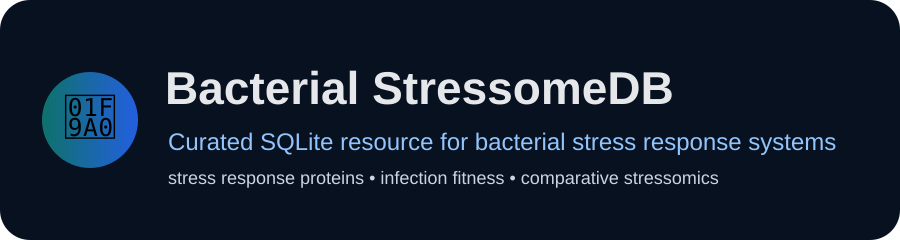
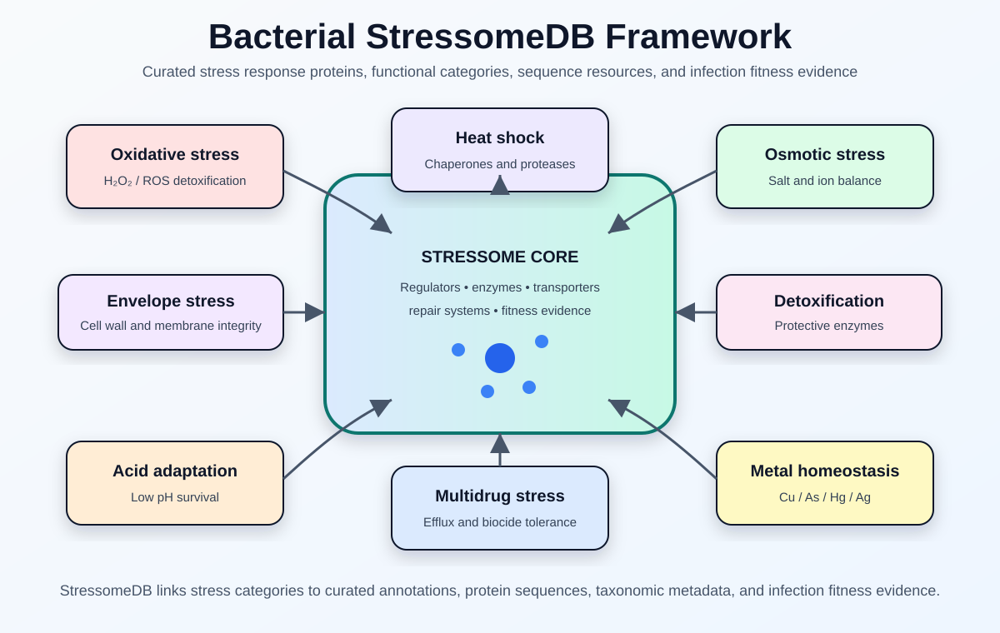
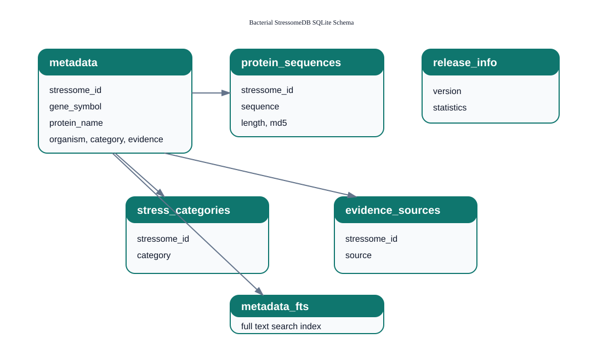

# 🦠 Bacterial StressomeDB

<p align="center">
  
</p>

<p align="center">
  <a href="https://bacterial-stressomedb.online/"></a>
  
  
  <a href="LICENSE"></a>
  <a href="CITATION.cff"></a>
</p>

---

## Overview

**Bacterial StressomeDB** is a curated biological resource for bacterial stress-response genes, proteins, functional categories, and associated evidence across clinically important and environmentally relevant bacterial taxa.

In this resource, the bacterial **stressome** is used as an operational term for the repertoire of genes, proteins, and functional systems associated with bacterial sensing, response, protection, repair, detoxification, homeostasis, and survival under environmental or host-associated stress.

The online resource is available at:

### 🌐 https://bacterial-stressomedb.online/

This GitHub repository provides the official downloadable **SQLite release** of Bacterial StressomeDB together with documentation, schema information, citation metadata, release information, and a lightweight Python command-line utility for local use.

The database and command-line tool can be downloaded together and used locally without requiring a separate database server.

The web platform remains the recommended interface for interactive browsing, visualization, sequence exploration, stress-category browsing, and taxonomic exploration.

---

## Stressome framework

<p align="center">
  
</p>

<p align="center"><b>Conceptual framework of bacterial stress-response systems represented in Bacterial StressomeDB.</b></p>

Bacterial StressomeDB separates:

- **biological stress-response classification**
- **evidence provenance**
- **protein sequence information**
- **taxonomic information**
- **infection-fitness evidence**
- **database release metadata**

This separation allows stress-response labels to be interpreted independently of the source or type of supporting evidence.

---

## Database at a glance

| Feature | Current release |
|---|---:|
| Curated metadata records | 18,391 |
| Unique nonredundant protein sequences | 14,603 |
| Atomic stress-response labels | 17 |
| Observed category-label combinations | 24 |
| Higher-order functional groups | 9 |
| Bacterial taxa | 1,466 |
| BacFITBase-linked records | 3,378 |
| Infection-fitness measurements used in the companion analysis | 1,969 |
| Official downloadable format | SQLite |
| Release version | v1.0.0 |
| Release commit | `9327f993c3f6ff5054d3f2cde967cbdd42f9ca5f` |

---

## Official database file

The repository distributes Bacterial StressomeDB as a single SQLite database:

```text
database/
└── Bacterial_StressomeDB_v1.sqlite
```

The SQLite release contains:

- curated stress-response metadata
- nonredundant protein sequences
- stress-category assignments
- higher-order functional group assignments
- evidence-source information
- taxonomic information
- BacFITBase-linked information
- release statistics
- joined views for convenient querying
- full-text search support

Separate CSV and FASTA files are not required for distribution because the metadata and protein sequences are stored directly in the SQLite database.

Protein sequences and metadata can nevertheless be exported locally using the command-line utility.

---

## Repository structure

```text
Bacterial-Stressomedb/
├── assets/
│   ├── logo.svg
│   ├── stressome_framework.svg
│   └── sqlite_schema.svg
├── database/
│   ├── Bacterial_StressomeDB_v1.sqlite
│   ├── schema.sql
│   └── release_notes.md
├── docs/
│   ├── database_construction.md
│   ├── data_dictionary.md
│   ├── stress_categories.md
│   └── sqlite_usage.md
├── stressomedb.py
├── pyproject.toml
├── CITATION.cff
├── LICENSE
└── README.md
```

---

## What the database contains

| Component | Description |
|---|---|
| Stress-response records | Curated records containing gene symbols, protein names, descriptions, organisms, accessions, stress assignments, and evidence metadata |
| Protein sequences | Sequence-nonredundant protein reference set stored directly in SQLite |
| Atomic labels | Mechanistically defined stress-response labels used for biological classification |
| Composite labels | Observed multi-label combinations retained when independent evidence supports more than one stress-response function |
| Higher-order groups | Nine broad functional groups used for summary and comparative analysis |
| Evidence sources | Integrated information from UniProtKB/Swiss-Prot, KEGG Orthology, and BacFITBase |
| Infection-fitness evidence | BacFITBase-linked records and experimental fitness annotations where available |
| Taxonomy | Organism and taxonomic identifiers linked to curated records |
| Search index | SQLite full-text search support for genes, proteins, organisms, accessions, categories, and descriptions |
| Release metadata | Version-level statistics and release information |

---

## Major stress-response groups

Bacterial StressomeDB organizes stress-response determinants into nine higher-order groups:

1. **Oxidative stress**
2. **Metal homeostasis and resistance**
3. **Acid adaptation**
4. **Envelope stress**
5. **Heat shock**
6. **Osmotic stress**
7. **Detoxification systems**
8. **Multidrug and biocide efflux**
9. **Global stress regulation**

<details>
<summary><b>View representative stress-response mechanisms</b></summary>

| Stress group | Representative systems |
|---|---|
| Oxidative stress | Catalases, superoxide dismutases, peroxidases, OxyR/SoxRS-related systems |
| Metal homeostasis and resistance | Copper, arsenic, mercury, silver, tellurite, and divalent-metal resistance/efflux systems |
| Acid adaptation | Acid-resistance systems, proton homeostasis, decarboxylases, low-pH survival systems |
| Envelope stress | Cell-envelope protection, membrane repair, Cpx/RpoE-related responses |
| Heat shock | DnaK, GroEL, Clp proteins, molecular chaperones, protein-quality-control systems |
| Osmotic stress | Kdp, Kef, compatible-solute transport, osmoprotection and salt-adaptation systems |
| Detoxification systems | DNA-damage response, DNA repair, detoxification-associated pathways |
| Multidrug and biocide efflux | Acr, Mex, Emr and related multidrug/biocide efflux systems |
| Global stress regulation | Two-component systems, starvation response, broad stress regulators |

</details>

---

## Curation principles

Records were assigned to defined mechanistic stress-response labels when available evidence supported a role in one or more of the following:

- stress sensing or regulation
- detoxification or stressor export
- stress-associated cellular homeostasis
- protection from stress-induced damage
- repair of stress-induced molecular damage
- protein quality control
- another defined stress-response process

General metabolic, housekeeping, transport, virulence, or growth-associated functions were not considered sufficient for mechanistic stress classification in the absence of independent stress-specific evidence.

### Multifunctional proteins

Proteins may retain more than one atomic stress-response label when independent evidence supports multiple functions.

### Unclassified stress records

Records with stress-associated evidence but insufficient support for a specific mechanistic label may be retained as **Unclassified stress**.

### Conflicting annotations

Where annotations conflict, direct mechanistic evidence and reviewed function-specific evidence are prioritized over generic descriptions or pathway-level inference.

Detailed category definitions and decision rules are provided in:

[`docs/stress_categories.md`](docs/stress_categories.md)

---

## Evidence framework

Bacterial StressomeDB integrates three complementary evidence sources:

1. **UniProtKB/Swiss-Prot** — reviewed protein annotations and curated protein sequence information.
2. **KEGG Orthology** — orthology- and pathway-supported functional information.
3. **BacFITBase** — experimentally derived infection-fitness information from transposon-based insertion-mutagenesis studies.

BacFITBase evidence is treated as **infection-fitness evidence** and is not used alone to assign a specific biochemical stress-response mechanism.

---

## Database construction summary

Bacterial StressomeDB was constructed by integrating curated records from UniProtKB/Swiss-Prot, KEGG Orthology, and BacFITBase.

Records were standardized into a common schema. The harmonization process included:

- protein identifiers
- gene symbols
- protein names
- organism names
- taxonomic identifiers
- functional descriptions
- stress-response labels
- higher-order functional groups
- evidence sources
- evidence types
- literature references
- external accessions
- protein sequence metadata

Protein sequences were dereplicated at **100% amino-acid sequence identity** to create a sequence-nonredundant reference collection.

Identical sequences were represented by a single reference sequence, whereas homologous proteins containing sequence variation were retained as distinct sequences to preserve biologically relevant taxonomic and functional diversity.

Full construction details are provided in [`docs/database_construction.md`](docs/database_construction.md).

---

## SQLite schema

<p align="center">
  
</p>

The SQLite database includes tables and views for curated records, sequences, categories, evidence, taxonomy, and release metadata.

<details>
<summary><b>View main SQLite tables and views</b></summary>

| Table or view | Description |
|---|---|
| `stressome_records` | Main curated metadata table |
| `protein_sequences` | Unique nonredundant protein sequences |
| `record_categories` | Exploded category assignments and higher-order groups |
| `stress_category_map` | Mapping between stress categories and higher-order groups |
| `evidence` | Evidence-source and evidence-level information |
| `organisms` | Organism and taxonomic information |
| `records_with_sequences` | Joined view linking curated records with protein sequences |
| `category_summary` | Summary view of categories and higher-order groups |
| `stressome_fts` | SQLite full-text search index |
| `release_info` | Version-level release statistics |

</details>

A complete data dictionary is available at [`docs/data_dictionary.md`](docs/data_dictionary.md).

---

# Quick start

The repository can be used in two ways:

### Option 1 — Interactive web use

Open:

https://bacterial-stressomedb.online/

Recommended for interactive browsing, visualization, category exploration, taxonomic exploration, sequence exploration, and individual record inspection.

### Option 2 — Local command-line use

Recommended for reproducible queries, batch searches, automated workflows, metadata export, protein-sequence export, downstream bioinformatics analysis, and local sequence comparison.

---

# Local command-line use

The repository includes the SQLite database together with a lightweight Python command-line utility:

```text
database/Bacterial_StressomeDB_v1.sqlite
stressomedb.py
```

No database server is required.

---

## Requirements

### Required for database querying

- Python 3.9 or newer
- standard Python SQLite support

Python normally includes SQLite support through the built-in `sqlite3` module.

### Optional for sequence similarity searching

- NCBI BLAST+

BLAST+ is required only if users want to perform local BLASTp searches against the exported StressomeDB protein reference set.

---

## Download the repository

```bash
git clone https://github.com/microbes-potential/Bacterial-Stressomedb.git
cd Bacterial-Stressomedb
```

Alternatively, download the repository as a ZIP file from GitHub and extract it locally.

---

## Create a Python environment

### Linux/macOS

```bash
python3 -m venv .venv
source .venv/bin/activate
```

### Windows Command Prompt

```bat
python -m venv .venv
.venv\Scripts\activate
```

### Windows PowerShell

```powershell
python -m venv .venv
.\.venv\Scripts\Activate.ps1
```

---

## Install Bacterial StressomeDB

```bash
python -m pip install .
```

Confirm installation:

```bash
stressomedb --help
```

---

## Use without installation

```bash
python stressomedb.py --help
```

Examples:

```bash
python stressomedb.py stats
python stressomedb.py search --query oxyR
```

---

# Command-line examples

## View release statistics

```bash
stressomedb stats
```

## Search for a gene or protein

```bash
stressomedb search --query oxyR
stressomedb search --query dnaK
stressomedb search --query katG
```

## Search by organism

```bash
stressomedb search --query "Escherichia coli"
stressomedb search --query "Staphylococcus aureus"
```

## Search by functional term

```bash
stressomedb search --query "oxidative stress"
stressomedb search --query "copper resistance"
stressomedb search --query "acid resistance"
```

## Browse a higher-order stress-response group

```bash
stressomedb category --group "Metal homeostasis and resistance"
```

Other examples:

```bash
stressomedb category --group "Oxidative stress"
stressomedb category --group "Acid adaptation"
stressomedb category --group "Envelope stress"
stressomedb category --group "Heat shock"
stressomedb category --group "Osmotic stress"
stressomedb category --group "Detoxification systems"
stressomedb category --group "Multidrug and biocide efflux"
stressomedb category --group "Global stress regulation"
```

## Retrieve a protein sequence

```bash
stressomedb sequence --id StressomeDB_0000001
```

Save to FASTA:

```bash
stressomedb sequence   --id StressomeDB_0000001   --output protein.faa
```

## Export the complete protein reference set

```bash
stressomedb export-fasta   --output Bacterial_StressomeDB_v1.faa
```

## Export metadata

```bash
stressomedb export-metadata   --output StressomeDB_metadata.tsv
```

---

# Direct SQLite querying

Start the SQLite shell:

```bash
sqlite3 database/Bacterial_StressomeDB_v1.sqlite
```

## Search for a gene or protein

```sql
SELECT
    stressome_id,
    gene_symbol,
    protein_name,
    organism,
    stress_category
FROM stressome_records
WHERE gene_symbol LIKE '%oxyR%'
   OR protein_name LIKE '%OxyR%'
LIMIT 20;
```

## List the largest stress categories

```sql
SELECT
    stress_category,
    COUNT(*) AS records
FROM record_categories
GROUP BY stress_category
ORDER BY records DESC;
```

## Retrieve a protein sequence

```sql
SELECT
    r.stressome_id,
    r.gene_symbol,
    r.protein_name,
    p.sequence
FROM stressome_records r
JOIN protein_sequences p
    ON r.sequence_md5 = p.sequence_md5
WHERE r.gene_symbol LIKE '%dnaK%'
LIMIT 5;
```

## List records from a bacterial species

```sql
SELECT
    stressome_id,
    gene_symbol,
    protein_name,
    stress_category
FROM stressome_records
WHERE organism LIKE '%Escherichia coli%'
LIMIT 50;
```

## Count records by higher-order group

```sql
SELECT
    higher_order_group,
    COUNT(*) AS records
FROM record_categories
GROUP BY higher_order_group
ORDER BY records DESC;
```

---

# Local protein-sequence search

Users can export the reference protein collection and search their own protein sequences locally.

## Step 1 — Export StressomeDB proteins

```bash
stressomedb export-fasta   --output Bacterial_StressomeDB_v1.faa
```

## Step 2 — Install NCBI BLAST+

### Ubuntu/Debian

```bash
sudo apt-get update
sudo apt-get install ncbi-blast+
```

### macOS using Homebrew

```bash
brew install blast
```

For Windows, install NCBI BLAST+ from the official NCBI distribution.

Verify installation:

```bash
blastp -version
```

## Step 3 — Build a local BLAST database

```bash
makeblastdb   -in Bacterial_StressomeDB_v1.faa   -dbtype prot   -parse_seqids   -out StressomeDB
```

## Step 4 — Search a user protein FASTA file

```bash
blastp   -query user_proteins.faa   -db StressomeDB   -evalue 1e-5   -outfmt "6 qseqid sseqid pident qcovhsp evalue bitscore"   -num_threads 4   -out StressomeDB_hits.tsv
```

Output columns:

```text
query_id
StressomeDB_reference_id
percent_identity
query_coverage
evalue
bitscore
```

## Step 5 — Apply the companion-analysis similarity criteria

The companion comparative study used:

- amino-acid identity ≥70%
- query coverage ≥80%
- E-value ≤1 × 10⁻⁵

On Linux/macOS:

```bash
awk '$3 >= 70 && $4 >= 80 && $5 <= 1e-5'   StressomeDB_hits.tsv   > StressomeDB_hits_filtered.tsv
```

These thresholds are operational screening criteria for high-similarity candidate homologue detection and are **not** intended as universal thresholds for functional or evolutionary orthology.

---

# Example end-to-end workflow

```bash
git clone https://github.com/microbes-potential/Bacterial-Stressomedb.git
cd Bacterial-Stressomedb

python3 -m venv .venv
source .venv/bin/activate

python -m pip install .

stressomedb stats

stressomedb export-fasta   --output Bacterial_StressomeDB_v1.faa

makeblastdb   -in Bacterial_StressomeDB_v1.faa   -dbtype prot   -out StressomeDB

blastp   -query user_proteins.faa   -db StressomeDB   -evalue 1e-5   -outfmt "6 qseqid sseqid pident qcovhsp evalue bitscore"   -out StressomeDB_hits.tsv

awk '$3 >= 70 && $4 >= 80 && $5 <= 1e-5'   StressomeDB_hits.tsv   > StressomeDB_hits_filtered.tsv
```

---

# Reproducibility and companion comparative analysis

The database repository contains the versioned Bacterial StressomeDB release and database documentation.

The separate repository containing scripts and reproducibility materials for the comparative genomic analysis is:

https://github.com/microbes-potential/Bacterial-StressomeDB-Comparative-Analysis

Database release used in the companion manuscript:

```text
Release: v1.0.0
Commit: 9327f993c3f6ff5054d3f2cde967cbdd42f9ca5f
```

---

## Scientific applications

Bacterial StressomeDB can support:

- comparative bacterial stressomics
- functional genome annotation
- protein-sequence annotation
- stress-response gene screening
- taxonomic exploration of stress-response systems
- infection-fitness interpretation
- comparative analysis of stress-response repertoires
- host-associated stress-response research
- evolutionary analysis of bacterial stress-associated systems
- identification of recurrent or conserved stress-response modules
- hypothesis generation for experimental validation
- reproducible computational screening of bacterial protein datasets

The database itself does not establish expression, phenotype, causation, essentiality, pathogenicity, or therapeutic utility without additional experimental evidence.

---

## Online versus local use

### Use the web platform for:

- interactive browsing
- graphical summaries
- stress-category exploration
- taxonomic exploration
- individual-record inspection
- online sequence exploration
- visualization

### Use the local command-line interface for:

- reproducible database querying
- batch analysis
- scripting
- automated workflows
- FASTA export
- metadata export
- downstream bioinformatics pipelines
- local sequence comparison

---

## Documentation

| Document | Description |
|---|---|
| [`docs/database_construction.md`](docs/database_construction.md) | Database curation, integration, normalization, sequence dereplication, and release workflow |
| [`docs/data_dictionary.md`](docs/data_dictionary.md) | SQLite table and column descriptions |
| [`docs/stress_categories.md`](docs/stress_categories.md) | Atomic labels, category definitions, higher-order groups, inclusion/exclusion criteria, and multi-label rules |
| [`docs/sqlite_usage.md`](docs/sqlite_usage.md) | Example SQLite queries |
| [`database/schema.sql`](database/schema.sql) | SQL schema extracted from the release database |
| [`database/release_notes.md`](database/release_notes.md) | Version-level release notes and statistics |
| [`CITATION.cff`](CITATION.cff) | Citation metadata |

---

## Versioning

Current release:

```text
v1.0.0
```

Associated commit:

```text
9327f993c3f6ff5054d3f2cde967cbdd42f9ca5f
```

Users are encouraged to report the database release version when publishing analyses performed with Bacterial StressomeDB.

---

## Citation

If you use Bacterial StressomeDB, please cite:

> Farooq A., Kim H.S., Rafique A., Han E. **Comparative Genomics of Stress-Response Gene Repertoires in Human Clinical Bacterial Isolates Using StressomeDB.** Manuscript under revision.

Please also report the database version used, for example:

> Bacterial StressomeDB v1.0.0.

See also [`CITATION.cff`](CITATION.cff).

---

## License

This repository is released under the **MIT License**.

See [`LICENSE`](LICENSE).

---

## Acknowledgements

Bacterial StressomeDB integrates information derived from:

- UniProtKB/Swiss-Prot
- KEGG Orthology
- BacFITBase
- NCBI
- GenBank

We acknowledge the developers, curators, maintainers, and contributors of these resources.

---

## Contact

For database-related questions, issues, or suggestions, please use the GitHub **Issues** page associated with this repository.

For interactive access:

### https://bacterial-stressomedb.online/

---

## Release information

**Bacterial StressomeDB**  
Version: **v1.0.0**  
Database format: **SQLite**  
Repository: **https://github.com/microbes-potential/Bacterial-Stressomedb**  
Web platform: **https://bacterial-stressomedb.online/**  
Companion analysis repository: **https://github.com/microbes-potential/Bacterial-StressomeDB-Comparative-Analysis**
